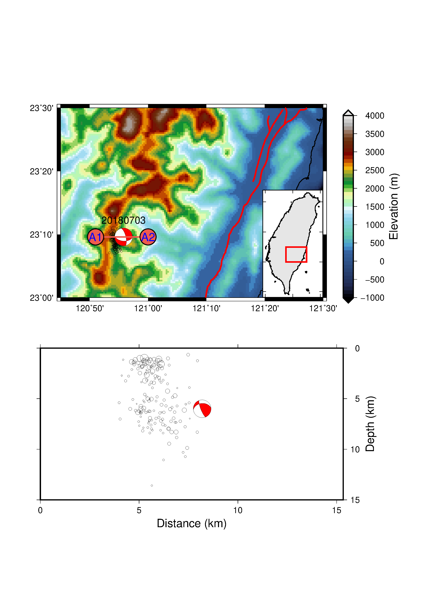

# Growclust relocation result discussion 

## before Relocation

## after Relocation via GrowClust

## Steps

1. Get [GrowClust](https://github.com/dttrugman/GrowClust.git), modify `maxevid` number if event id too large, compile it with `CFLAGS = -O -mcmodel=large`, install it in `$PATH`(recommended).
2. Our event cluster folder: `201807030920_inv`, enter it and just run: `growclust GC_inv.inp`, let it run.
3. Read GrowClust Manual Chapter 4.1, "Relocated catalog file", use below information to let Generic Mapping Tools draw it:
    - column 8 : relocated latitude
    - column 9 : relocated longitude
    - column 10: relocated depth
    - column 11: magnitude
    - column 23: initial latitude
    - column 24: initial longitude
    - column 25: initial depth
4. Read GrowClust Manual Chapter 4.2, "Relocated cluster file", use below information to let Generic Mapping Tools draw it:
  - 6 columns header:
    + column 1 : cluster serial ID number
    + column 3 : latitude of cluster centroid
    + column 4 : longitude of cluster centroid
    + column 5 : depth of cluster centroid
  - 22 columns event line:
    + column 1 : cluster serial ID number
    + column 4 : magnitude
    + column 11: relocated latitude
    + column 12: relocated longitude
    + column 13: relocated depth
5. modify example script provided by teacher.
6. done!

# Claim

* just for study, if there's any copyright problem, please add issue here and I'll reply ASAP.

# References

* https://github.com/dttrugman/GrowClust/raw/master/growclust-userguide.pdf
